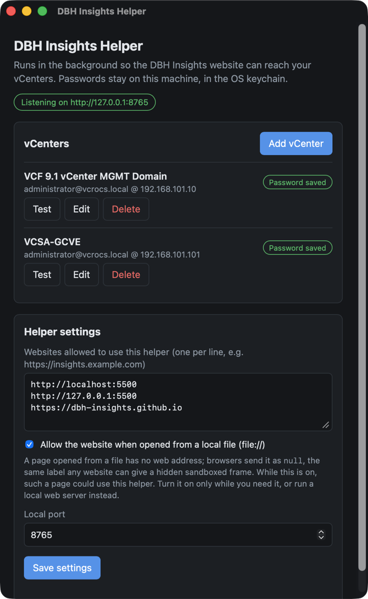
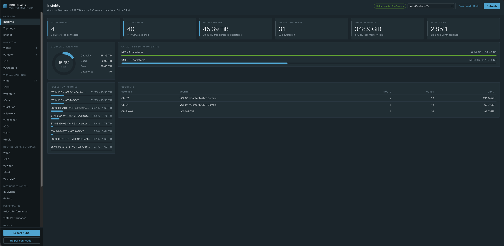
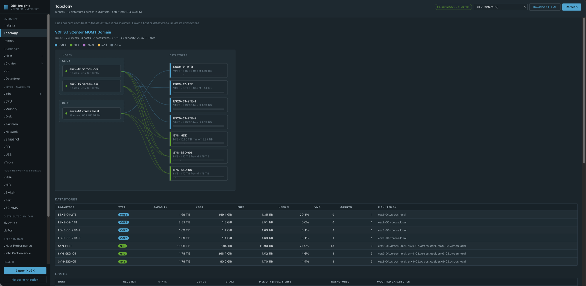
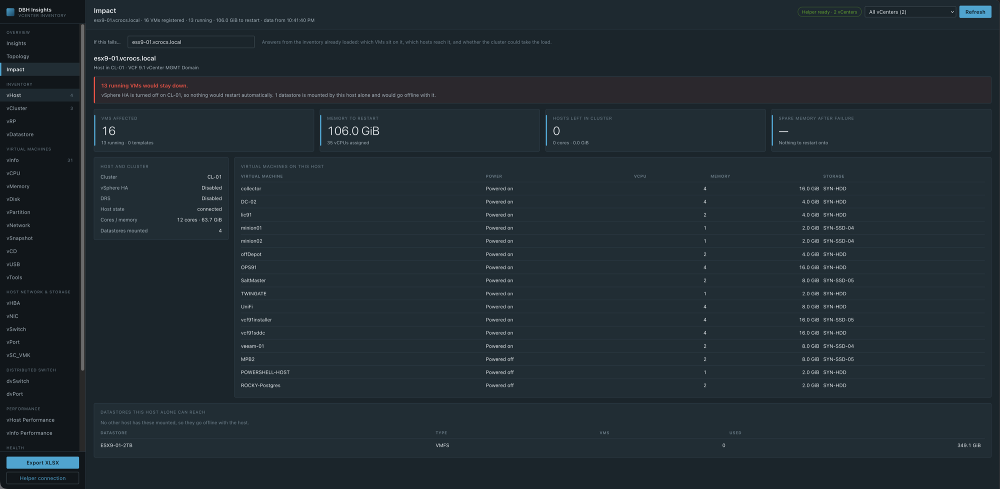
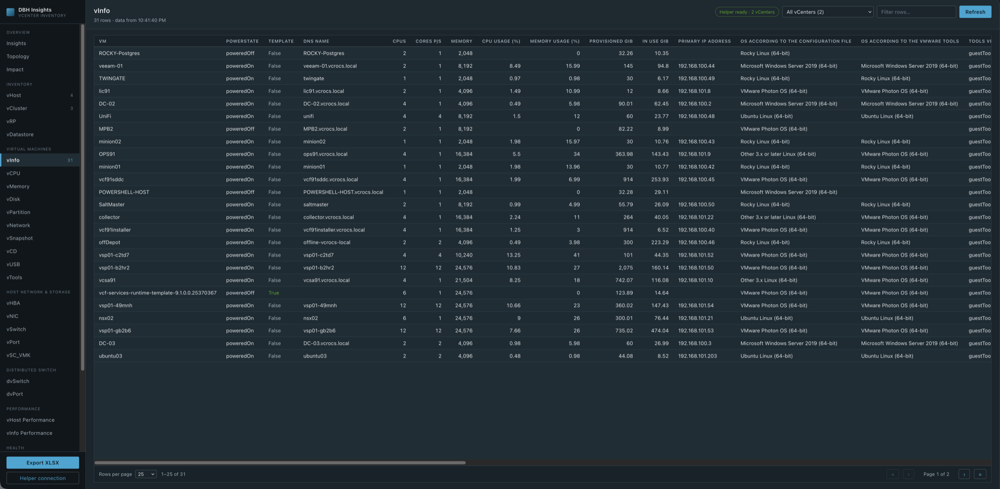
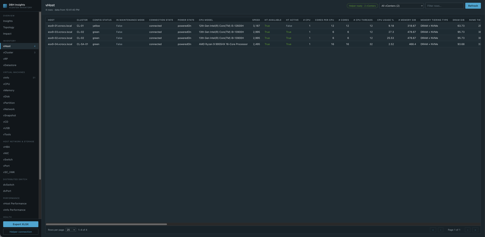

### DBH Insights: My Hackathon Idea Became a Real Tool 🚀

Back in August I wrote about my idea for the VMware Explore 2026 Hackathon: a modern, cross-platform way to pull inventory out of vCenter. Multi-vCenter support, easy spreadsheet exports, and an "Impact Analyst" to show what is affected if a host is not available.

After Explore I couldn't stop thinking about it. So I kept building. It started as a voice conversation with Claude about how the pieces should fit together, and within a few days I had a working tool running against my VCF 9.1 lab.

I'm calling it **DBH Insights**, and I wanted to share it with the vCommunity.

---

#### What is DBH Insights? 💡

DBH Insights is a website that reads your vCenter inventory and turns it into:

- A dashboard with the numbers everyone asks for
- A topology map of hosts and datastores
- An Impact view that answers "what if this host or datastore fails?"
- 27 inventory sheets you can sort, filter, and export to Excel

If you have used RVTools, the sheets will feel familiar. The difference is that everything runs in your browser, works with more than one vCenter at a time, and the helper runs on Mac and Windows today, with Linux coming.

---

#### How It Works 🔧

There are two pieces:

- **The website** has all the screens and all the vCenter queries. When I add a new feature, everyone gets it the next time they open the page. Nothing to reinstall.
- **The DBH Insights Helper** is a small app that runs on your computer. It sits in the menu bar or system tray and does the talking to vCenter.

Why a helper? A browser can't talk to a vCenter on your local network, and it won't trust vCenter's self-signed certificate. More important, you should never type your vCenter password into a website. The helper solves all three. Your password is saved in your computer's keychain and never leaves your machine.

The flow is simple:

**Browser → DBH Insights Helper (on your computer) → vCenter**

Add a vCenter once, click **Save & test**, and you're done. You can add as many vCenters as you want.

#### DBH Insights Helper (Screen Shot):



---

#### Insights Dashboard 📊

This is the first thing you see. Total hosts, cores, storage, VMs, physical memory, and the vCPU to core ratio. It also shows storage used, capacity by datastore type, the fullest datastores, and every cluster. This screen shot is from my lab with 2 vCenters, 4 hosts, and 31 VMs.

You can save the dashboard as a single HTML file to email or keep for later.



---

#### Topology 🗺️

Every host, grouped by cluster, with a line to each datastore it has mounted. Hover over a host or a datastore to see only its connections. This makes it easy to spot a datastore that only one host can see.



---

#### Impact | What If a Host Fails? ⚠️

This one was on my Hackathon wish list, and it is my favorite feature.

Pick a host or a datastore and DBH Insights tells you what depends on it:

- Which VMs are running on it
- If vSphere HA would restart those VMs on another host
- If the other hosts in the cluster have enough memory to take the VMs
- Any datastore that only this host can reach

The search box lets you find a host or datastore fast, even if you have hundreds of them.

In this example, my host esx9-01 is the only host in its cluster and HA is off. If it failed, 13 running VMs would stay down. Good to know before it happens! 😎



---

#### 27 Inventory Sheets 📋

The sheets are grouped the same way you think about vSphere:

- **Inventory** | vHost, vCluster, vRP, vDatastore
- **Virtual machines** | vInfo, vCPU, vMemory, vDisk, vPartition, vNetwork, vSnapshot, vCD, vUSB, vTools
- **Host network & storage** | vHBA, vNIC, vSwitch, vPort, vSC_VMK
- **Distributed switch** | dvSwitch, dvPort
- **Performance** | vHost Performance, vInfo Performance
- **Health** | vHealth
- **System** | vSource, vLicense, vMetaData

Every sheet can be sorted, filtered, and paged. When you pick "All vCenters", each row shows which vCenter it came from.

#### vInfo (Screen Shot):



#### vHost (Screen Shot):



---

#### Export to Excel 📤

One click on **Export XLSX** and you get every sheet in one Excel workbook. Frozen header row, filters turned on, and real dates. The file is built right in your browser.

---

#### Read Only. Always. 🔒

I wanted this to be safe to run in any environment:

- DBH Insights only **reads** from vCenter. There is no setting to make changes.
- Your passwords stay in your computer's keychain (macOS Keychain or Windows Credential Manager).
- The helper only listens on your own computer (127.0.0.1).
- Only websites you approve can use the helper.

---

#### Hackathon Wish List | How Did I Do? ✅

Here is the list from my Hackathon blog, and where things stand today:

- ✅ Multi-vCenter support
- ✅ Easy spreadsheet exports
- ✅ Impact Analyst: what is affected if a host is not available
- ✅ Runs on macOS and Windows (Linux build coming)
- ⏳ Built-in scheduler for automatic runs
- ⏳ VCF Fleet Manager integration for automatic vCenter discovery

Not bad for a few days of work. The last two are next on my list.

---

#### Try It 🔗

1. Go to [https://dbh-insights.github.io](https://dbh-insights.github.io)
2. Download the DBH Insights Helper for macOS (Apple silicon) or Windows
3. Open the helper, click **Add vCenter**, and click **Save & test**
4. Click **Open DBH Insights**

The helper is not signed yet, so your computer will warn you the first time.

On **macOS**, if you see "DBH Insights Helper is damaged and can't be opened", it isn't damaged. Run this once in Terminal, then open the app again:

```bash
xattr -dr com.apple.quarantine "/Applications/DBH Insights Helper.app"
```

On **Windows**, if you see "Windows protected your PC", click **More info** and then **Run anyway**.

---

#### For the Techies 🤓

- The helper is built with Tauri and Rust, so it is small and can be built for Mac, Windows, and Linux.
- The website is plain HTML and JavaScript. No build step.
- DBH Insights uses both vCenter APIs: REST, plus SOAP for details REST doesn't have, like host hardware, snapshots, and performance counters.
- I built it with Claude Code as my AI pair programmer. It was a great example of turning an idea into working code fast.

---

I always appreciate feedback. Let me know what you like, and what you would add next. See you in the vCommunity!
